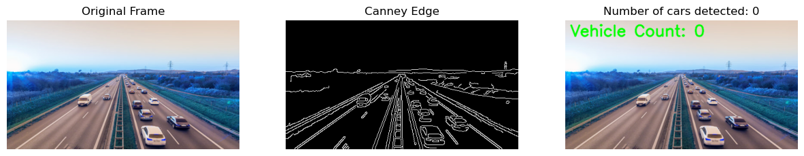
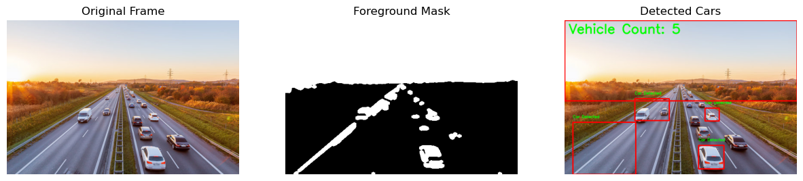

# CV_vehicle_counter :car:

## Introduction
In an era where urbanization and population growth are accelerating, efficient transportation systems have
become crucial for the sustainability and livability of cities. As the number of vehicles on the roads continues
to rise, managing traffic congestion, improving road safety, and planning future infrastructure developments
are pressing challenges. Accurate and real-time data on vehicle movement is essential to address these issues
effectively. Our Car Counting Project aims to provide a robust solution for real-time vehicle detection and
counting, offering critical insights for transportation planning and traffic management

# Vehicle Detection using Computer Vision and Machine Learning

## Methods

Our dataset contains images of highways with labels of motorcycles, Sedans, SUVs, trucks, vans, and pickups. In our vehicle detection algorithms, we ignored all motorcycles and summed up the instances of Sedans, SUVs, vans, and pickups to be the number of cars.

### Computer Vision Techniques

We initially attempted to implement vehicle detection using techniques purely in computer vision. Many of these algorithms have limitations and require specific conditions to work correctly. Among them, we tried edge detection and background subtraction algorithms. It is written on `CV_car_detection.ipynb`

#### Edge Detection

- **Process:** Gray → Gaussian blur (remove noises) → Get edges (Canny Edge) → Find contour
- **Description:** We used the Canny Edge detection algorithm to identify the boundaries of an image. After detecting edges, we used a contour detector to find continuous edges that form shapes, which might be vehicles. Vehicle detection using edge detection performed poorly because of the complexity of vehicle shapes, ambiguity in edge formation, and inadequate contour formation. The edge detection algorithm struggles to accurately delineate vehicle boundaries, which leads to inaccurate contours.

#### Background Subtraction

- **Process:** Gray → Gaussian blur (remove noises) → Threshold to remove shadows → Apply some morphological operations to ensure a good mask (getStructuringElement, erode, dilate) → Find contour
- **Description:** Background subtraction can be limited in its effectiveness for vehicle detection in images. One major challenge arises from the need for a consistent and accurate background model. Background subtraction techniques rely on the assumption that the scene’s background remains relatively static over time. However, in real-world scenarios, backgrounds can vary due to changes in lighting conditions, moving objects, or environmental factors. Analyzing a single image lacks the temporal context necessary for accurate background modeling. Without prior knowledge of the background or a reference image captured from the same angle without any vehicles present, background subtraction may yield inaccurate results.

 

#### Summary

Background subtraction and edge detection are fundamental techniques used for vehicle detection in images, each with its own set of challenges and limitations. Vehicle detection using edge detection performs poorly due to the complexity of vehicle shapes, ambiguity in edge formation, and inadequate contour formation. Similarly, the background subtraction technique is significantly limited when applied to single images due to the need for a consistent and accurate background model. Without an updated background model or a reference image without vehicles, background subtraction often yields inaccurate results. In contrast, `cv2.createBackgroundSubtractorMOG()`, a Gaussian Mixture-based Background/Foreground Segmentation Algorithm in CV2, performs well with video data by continuously updating the background model.

### Detection using Machine Learning

To find a better vehicle detector, we tried machine learning-based methods like You-Only-Look-Once (YOLO). YOLO is a popular object detection algorithm known for its speed and accuracy. The architecture of YOLO involves dividing the input image into a grid and predicting bounding boxes and class probabilities for each grid cell simultaneously. This allows YOLO to detect multiple objects in an image in real-time.

#### YOLOv3

Initially, we chose to use YOLOv3. The YOLOv3 object detection model runs a deep learning convolutional neural network (CNN) on an input image to produce network predictions from multiple feature maps. Then, the object detector gathers and decodes predictions to generate the bounding boxes. From these bounding boxes, YOLOv3 uses anchor boxes, where the model predicts these three attributes for each anchor box:
- **Intersection over union (IoU):** Predicts the objectness score of each anchor box.
- **Anchor box offsets:** Refine the anchor box position.
- **Class probability:** Predicts the class label assigned to each anchor box.

We compared the performance of YOLOv3 to other YOLO models, such as YOLOv2 and YOLOv4. From version two to four, improvements to object detection were made in both speed and accuracy through various machine learning techniques and changes in architecture. Since these are pretrained models, we combined all the images into one directory and tested on that.

### YOLO Vehicle Detection Models

This repository contains the configuration files and pre-trained weights for YOLOv2, YOLOv3, and YOLOv4 vehicle detection models.
`latest.ipynb` is the current file with the experimental results on the report.
the test example (`test_example.ipynb`) and the experimental results (`vehicle_detection.ipynb`)

#### YOLOv2

1. **Download YOLOv2 Configuration File:**
   - Navigate to the [cfg directory](https://github.com/pjreddie/darknet/tree/master/cfg) of the Darknet repository.
   - Download the [`yolov2.cfg`](https://github.com/pjreddie/darknet/blob/master/cfg/yolov2.cfg) file.

2. **Download YOLOv2 Pre-trained Weights:**
   - Look for the pre-trained weights file `yolov2.weights`.
   - Download the [`yolov2.weights`](https://github.com/pjreddie/darknet/blob/master/yolov2.weights) file.

#### YOLOv3

1. **Download YOLOv3 Configuration File:**
   - Navigate to the [cfg directory](https://github.com/pjreddie/darknet/tree/master/cfg) of the Darknet repository.
   - Download the [`yolov3.cfg`](https://github.com/pjreddie/darknet/blob/master/cfg/yolov3.cfg) file.

2. **Download YOLOv3 Pre-trained Weights:**
   - Look for the pre-trained weights file `yolov3.weights`.
   - Download the [`yolov3.weights`](https://github.com/pjreddie/darknet/blob/master/yolov3.weights) file.

#### YOLOv4

1. **Download YOLOv4 Configuration File:**
   - Navigate to the [cfg directory](https://github.com/AlexeyAB/darknet/tree/master/cfg) of the AlexeyAB repository.
   - Download the [`yolov4.cfg`](https://github.com/AlexeyAB/darknet/blob/master/cfg/yolov4.cfg) file.

2. **Download YOLOv4 Pre-trained Weights:**
   - Look for the pre-trained weights file `yolov4.weights`.
   - Download the [`yolov4.weights`](https://github.com/AlexeyAB/darknet/releases/download/darknet_yolo_v3_optimal/yolov4.weights) file.

### **Model Usage:**
   - Once you have downloaded both the configuration file and pre-trained weights for each YOLO version, you can use them with the Darknet framework for vehicle detection tasks.
   - You can save yolos models in a single directory.

